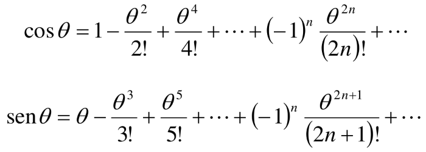

# TrigonometricasUsandoSerie
Cálculo das funções Seno e Cosseno usando séries numéricas

Uma maneira de implementar as funções que calculam o coseno e o seno
em programas de computador é através de séries de Taylor nas formas:

sendo que θ é o ângulo em radianos. Escreva um programa em C que:
a) Imprima, para um valor de ângulo em graus digitado pelo usuário, os
resultados das séries acima para 3 termos (ou seja, de _n=0_ até _n=2_);
b) Faça o mesmo para 40 termos;
c) Imprima os valores de coseno e seno para o ângulo digitado utilizando
as funções _cos( )_ e _sin( )_ da biblioteca _math.h_ ;
d) Imprima o erro (em valores absolutos e em porcentagem) entre os
valores calculados no itens a) e c) e entre b) e c).
